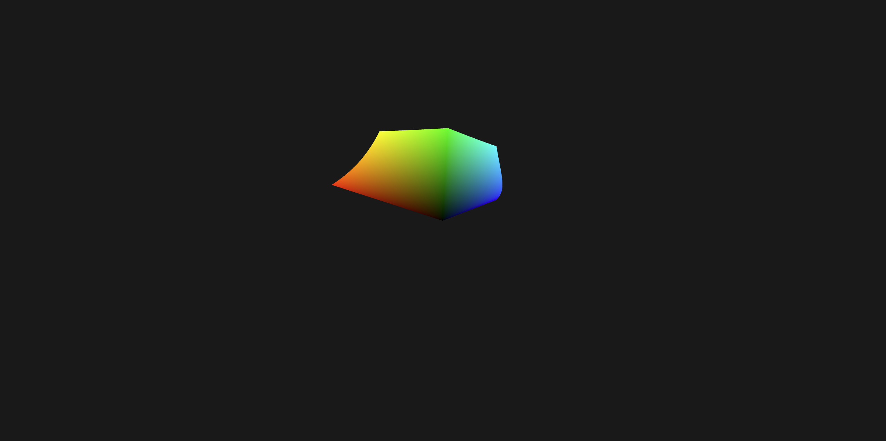

# TypeScript WebGPU Renderer

Planned to be a project template for WebGPU + TypeScript projects.

This project only depends on TypeScript and gl-matrix.

Included primitives:
- Cubes
- Icospheres
- Planes

